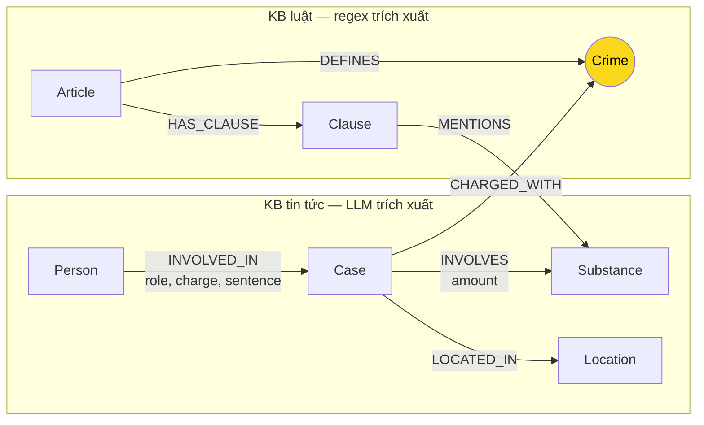

# Thiết kế Ontology — Day 19

**Họ tên:** Hoàng Đức Minh  
**MSSV:** 2A202602362

**Lựa chọn:**

- [x] Dùng ontology gợi ý (giữ nguyên cấu trúc để khớp pipeline trong `src/graph.py`)
- [ ] Tự thiết kế (xét bonus +15, xem `SUBMISSION.md`)

## 1. Sơ đồ

`Crime` là node cầu nối (màu vàng): cùng một tội danh chuẩn nối vụ việc trong tin tức với Điều BLHS định nghĩa tội đó. `Substance` cũng là thực thể dùng chung hai KB, nhưng chỉ hỗ trợ lọc theo chất; nó không đủ để xác định Điều/tội danh chính xác nên không được chọn làm cầu nối chính.

## 2. Entity types (node labels)

| Label | Ý nghĩa | Khóa định danh (`MERGE` theo) | Properties | Lấy từ KB nào | Trích bằng |
| --- | --- | --- | --- | --- | --- |
| `Article` | Một Điều luật, ví dụ `Điều 251 BLHS` | `id` | `id`, `title`, `law`, `doc_id` | Luật | Regex/front matter |
| `Clause` | Một khoản của Điều, ví dụ `Điều 251 BLHS khoản 1` | `id` | `id`, `number`, `penalty`, `text`, `doc_id` | Luật | Regex |
| `Crime` | Tội danh chuẩn hóa, bỏ tiền tố “Tội” và viết thường | `name` | `name` | Cả hai KB | Regex từ tiêu đề Điều; LLM từ tin rồi `link_entity` |
| `Case` | Một vụ việc/vụ án được bài báo mô tả | `name` | `name`, `summary`, `date`, `doc_id`, `source_title` | Tin tức | LLM |
| `Person` | Cá nhân xuất hiện trong vụ việc | `name` | `name`, `aliases` | Tin tức | LLM |
| `Substance` | Chất ma túy theo danh sách tên chuẩn, ví dụ `MDMA`, `Ketamine` | `name` | `name` | Cả hai KB | Tìm chuỗi/regex trong luật; LLM trong tin |
| `Location` | Địa điểm gắn với vụ việc | `name` | `name` | Tin tức | LLM |

`doc_id` được lưu trên các node trực tiếp đại diện cho một văn bản (`Article`, `Clause`, `Case`) để nối kết quả vector search với graph. `Crime`, `Substance`, `Person` và `Location` là thực thể được dùng chung giữa nhiều tài liệu, nên dùng khóa chuẩn thay vì gắn với một `doc_id` duy nhất.

## 3. Relationships

| Type | Từ → Đến | Properties trên cạnh | Ý nghĩa |
| --- | --- | --- | --- |
| `DEFINES` | `Article` → `Crime` | Không có | Điều luật định nghĩa tội danh ở tiêu đề. |
| `HAS_CLAUSE` | `Article` → `Clause` | Không có | Điều luật gồm các khoản; `Clause.number` giữ số khoản. |
| `MENTIONS` | `Clause` → `Substance` | Không có | Khoản luật nêu chất/nhóm chất này. |
| `CHARGED_WITH` | `Case` → `Crime` | Không có | Vụ việc bị khởi tố, truy tố hoặc xét xử về tội danh đó. |
| `INVOLVES` | `Case` → `Substance` | `amount` | Vụ việc liên quan chất ma túy; lượng nguyên văn được lưu để đối chiếu ngưỡng luật. |
| `LOCATED_IN` | `Case` → `Location` | Không có | Vụ việc xảy ra, bị phát hiện hoặc xét xử tại địa điểm được trích xuất. |
| `INVOLVED_IN` | `Person` → `Case` | `role`, `charge`, `sentence` | Cá nhân tham gia vụ việc; lưu vai trò, tội danh gắn với người và mức án khi bài viết nêu. |

## 4. Node cầu nối giữa 2 KB

- **Node nào:** `Crime`.
- **Vì sao chọn node này:** Tin tức thường nêu hành vi/tội danh và BLHS có Điều mang đúng tội danh. Vì vậy đường `Case → Crime ← Article` đưa được dữ kiện sự kiện (người, mức án, chất) sang căn cứ pháp lý (Điều, khoản, khung phạt). Ví dụ, “mua bán trái phép chất ma túy” nối vụ Lê Minh Thành với `Điều 251 BLHS`.
- **Cách đảm bảo hai phía khớp tên:** Tội trong luật được chuẩn hóa bằng `normalize_crime`: bỏ khoảng trắng thừa, chuyển chữ thường và bỏ tiền tố `Tội`. Prompt LLM đưa sẵn danh sách tội chuẩn; mọi tội LLM trả về vẫn được `link_entity` chuẩn hóa rồi so khớp chính xác hoặc so gần đúng (`difflib`, ngưỡng 0,8). Graph lưu lại đúng cách viết chuẩn trong danh sách luật.
- **Khi nào cầu gãy, và cách xử lý:** Cầu gãy khi bài báo không nêu tội danh, LLM bỏ sót/trích sai tội, hoặc cách gọi khác quá xa ngưỡng ghép (ví dụ chỉ ghi “hành vi ma túy”). Khi đó không tạo cạnh `CHARGED_WITH` để tránh nối sai. Cần kiểm tra bài gốc theo `Case.doc_id`, bổ sung alias/từ điển tội danh hoặc cải thiện prompt; chỉ hạ ngưỡng ghép sau khi đánh giá false positive. `Substance` có thể là tín hiệu hỗ trợ, không được dùng để tự suy ra tội danh.

## 5. Competency questions

| Câu | Đường đi (Cypher pattern) | Trả lời được? |
| --- | --- | --- |
| Q1 | `MATCH (a:Article {id:'Điều 2 Luật PCMT'})-[:HAS_CLAUSE]->(cl:Clause {number:4}) RETURN cl.text` | Có. Khoản 4 chứa định nghĩa “tiền chất”, gồm “điều chế”, “sản xuất” và “danh mục tiền chất”. |
| Q2 | `MATCH (p:Person)-[r:INVOLVED_IN]->(k:Case) WHERE k.doc_id = 'news-100260928173914514' AND r.sentence CONTAINS 'tử hình' RETURN p.name, r.sentence, r.charge` | Có. Lấy tên bị cáo và án từ cạnh `INVOLVED_IN`; `Case` định danh bài về đường dây hơn 36 kg. |
| Q3 | `MATCH (p:Person {name:'Lê Minh Thành'})-[r:INVOLVED_IN]->(k:Case)-[:CHARGED_WITH]->(c:Crime)<-[:DEFINES]-(a:Article)-[:HAS_CLAUSE]->(cl:Clause {number:1}) RETURN r.sentence, c.name, a.id, cl.penalty` | Có. Đường đi xuyên hai KB trả mức án, tội danh, Điều 251 và khung cơ bản khoản 1. |
| Q4 | `MATCH (p:Person)-[r:INVOLVED_IN]->(k:Case)-[:CHARGED_WITH]->(c:Crime)<-[:DEFINES]-(a:Article)-[:HAS_CLAUSE]->(cl:Clause {number:4}) WHERE 'Hoàng Nato' IN p.aliases OR p.name = 'Dương Minh Tuấn' RETURN p.name, r.charge, a.id, cl.penalty` | Có. `aliases` cho phép tìm biệt danh; khoản 4 Điều 255 chứa mức tối đa tù chung thân. |
| Q5 | `MATCH (p:Person {name:'Cái Quang Huy'})-[:INVOLVED_IN]->(k:Case)-[i:INVOLVES]->(s:Substance {name:'MDMA'}), (k)-[:CHARGED_WITH]->(:Crime)<-[:DEFINES]-(a:Article)-[:HAS_CLAUSE]->(cl:Clause {number:4})-[:MENTIONS]->(s) RETURN a.id, i.amount, cl.penalty` | Có, với điều kiện LLM trích đúng lượng MDMA. Q5 dùng hai hop qua `Crime` để xác định Điều 250 và một nhánh qua `Substance` để chọn khoản có MDMA; lượng `9,6kg` lớn hơn ngưỡng 100g ở khoản 4. |
| Q6 | `MATCH (k:Case)-[:INVOLVES]->(s:Substance {name:'MDMA'}) OPTIONAL MATCH (p:Person)-[:INVOLVED_IN]->(k) RETURN k.name, k.summary, collect(p.name)` | Có. Tập các `Case` cùng nối đến `MDMA` cho phép tổng hợp vụ Cái Quang Huy, vụ Lê Minh Thành và vụ Viện Pháp y tâm thần nếu LLM đã trích xuất chất. |

## 6. Quyết định thiết kế và đánh đổi

1. **Chọn `Crime` làm cầu nối chính.** Phương án khác là nối `Case` thẳng tới `Article`, hoặc dùng `Substance` làm cầu. Tách `Crime` thành node riêng giúp một tội được nhiều vụ và một Điều dùng chung, đồng thời thể hiện rõ bước chuẩn hóa; nối thẳng mất ngữ nghĩa, còn chất ma túy không xác định duy nhất Điều/tội.
2. **Tách `Article` và `Clause`; giữ khung phạt là property của `Clause`.** Phương án khác là chỉ tạo node `Article`, hoặc biến mỗi mức phạt thành node. Tách khoản là cần thiết cho Q3/Q5 vì khung cơ bản và ngưỡng MDMA nằm ở khoản khác nhau. `penalty` là thuộc tính văn bản, không có quan hệ độc lập trong tập câu hỏi, nên node riêng chỉ làm graph và prompt lớn hơn.
3. **Lưu mức án, vai trò, tội danh của người trên cạnh `INVOLVED_IN`.** Phương án khác là tạo `Sentence`/`Charge` thành node. Mức án phụ thuộc vào tổ hợp người–vụ và một người có thể có mức án khác ở vụ khác, nên để trên cạnh tránh gán nhầm. Đổi lại, khó tái sử dụng/so sánh mức án như một thực thể có cấu trúc.
4. **Dùng regex cho luật, LLM cho tin tức.** Luật có cấu trúc Điều–khoản đều đặn nên regex rẻ, nhanh, lặp lại được. Tin viết tự do, cần LLM nhận diện người, vai trò và vụ việc. Đánh đổi là kết quả từ tin có thể thiếu/trùng hoặc sai chuẩn hóa, nên phải giữ `doc_id` và kiểm tra các cạnh quan trọng.
5. **Dùng `name` làm khóa cho `Person`, `Case`, `Location`.** Phương án tốt hơn là khóa theo ID nguồn, ngày và thực thể đã giải quyết đồng tham chiếu. Trong phạm vi nhỏ, `name` đơn giản cho `MERGE`; đổi lại dễ gộp nhầm người trùng tên, tách một vụ có tên khác nhau hoặc ghi đè `doc_id` khi LLM đặt cùng tên.

## 7. So với ontology gợi ý (bắt buộc nếu xét bonus)

Không áp dụng: bài này sử dụng đúng ontology gợi ý để tập trung hoàn thành pipeline cơ sở; không yêu cầu xét bonus tự thiết kế.

## 8. Hạn chế còn lại

- `amount` giữ chuỗi nguyên văn như “hơn 9,6kg”, chưa được chuẩn hóa đơn vị hay tách cận dưới/cận trên; vì vậy việc áp ngưỡng khoản luật vẫn cần logic diễn giải ngoài graph.
- `MENTIONS` chỉ biểu thị khoản có nhắc chất, chưa biểu diễn từng điểm, khoảng khối lượng hay điều kiện phi khối lượng. Một khoản có thể nhắc MDMA nhưng không tự chứng minh là khoản phải áp dụng nếu tình tiết khác quyết định.
- Tên thực thể từ LLM có thể khác chính tả, thiếu dấu hoặc không đầy đủ. `MERGE` theo `name` không xử lý tốt đồng âm, bí danh chưa trích được, hay một vụ được nhiều bài báo tường thuật.
- Không mô hình hóa giai đoạn tố tụng (bắt, khởi tố, truy tố, xét xử, phúc thẩm), nên cạnh `CHARGED_WITH` có thể gom các trạng thái pháp lý khác nhau.
- Q1 là câu hỏi định nghĩa trong luật PCMT, không đi qua node cầu nối `Crime`; graph trả lời bằng `Article → Clause` và hybrid GraphRAG vẫn cần vector chunk để giữ nguyên văn đầy đủ.
