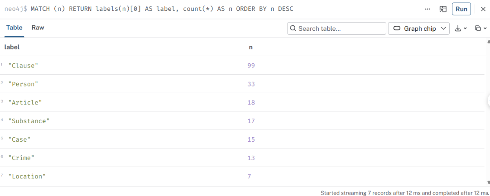
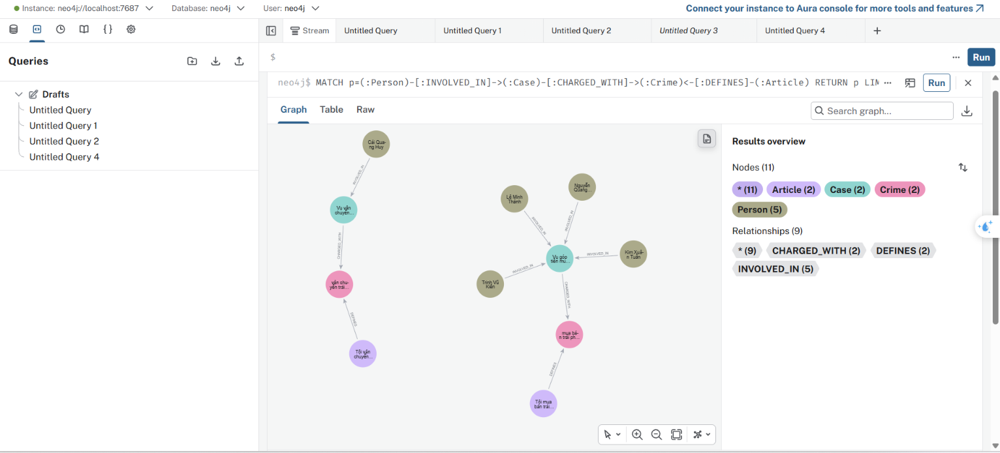
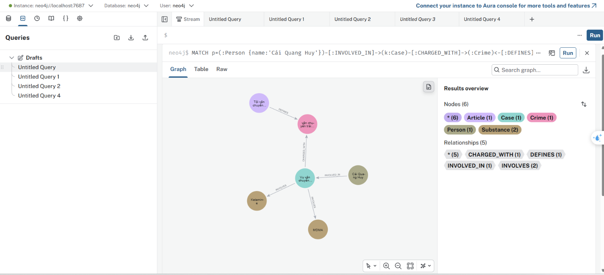

# Báo cáo Day 19 — Flat RAG vs GraphRAG

**Họ tên:** Hoàng Đức Minh  **MSSV:** 2A202602362  **Ngày:** 05/10/2026

> Kỳ vọng và thang điểm: `SUBMISSION.md`. Mọi số liệu phải khớp với `ket_qua_benchmark_kg.txt`. Bản thiết kế ontology nộp riêng ở `report/ONTOLOGY.md`.

## 1. Chi phí (10 điểm)

Dán 2 bảng `Indexing` và `Querying` từ `ket_qua_benchmark_kg.txt`:

```
== Indexing (one-off)
pipeline  calls    in_tok  out_tok       USD  seconds
flat        176     56072        0   0.00112     43.3
graph       196     91958     4818   0.00940    109.7

== Querying (mean per question)
pipeline  recall  judge   in_tok  out_tok       USD  seconds
flat        0.43   1.00      694       47   0.00013     1.38
graph       0.78   1.67     4240       68   0.00067     1.78
```

| Chỉ số | Flat | Graph | Graph / Flat |
| --- | --- | --- | --- |
| Indexing USD | 0.00112 | 0.00940 | ×8.39 |
| Indexing giây | 43.3 | 109.7 | ×2.53 |
| Mỗi câu: USD | 0.00013 | 0.00067 | ×5.15 |
| Mỗi câu: giây | 1.38 | 1.78 | ×1.29 |
| Mỗi câu: in_tok | 694 | 4,240 | ×6.11 |

**Chi phí tăng thêm đến từ đâu?** (2–3 câu)
> GraphRAG tốn thêm ở lúc dựng chỉ mục vì phải gọi LLM để trích xuất thực thể/vụ việc từ 20 bài tin: pipeline graph có 196 lượt gọi, nhiều hơn Flat 20 lượt, và phát sinh 4.818 output token. Khi hỏi, GraphRAG đưa thêm facts từ Neo4j vào prompt nên input trung bình tăng từ 694 lên 4.240 token; vì vậy chi phí mỗi câu tăng 5,15 lần, dù độ trễ chỉ tăng 1,29 lần. Chi phí dựng graph là one-off, nên chỉ đáng đổi lấy khi có đủ nhiều câu hỏi xuyên hai KB.

## 2. Từng câu hỏi (10 điểm)

| Câu | Loại | Flat recall / judge | Graph recall / judge | Thắng | Vì sao (1 câu) |
| --- | --- | --- | --- | --- | --- |
| Q1 | single-hop-law | 1.00 / 2 | 1.00 / 2 | Hòa | Định nghĩa nằm trong một đoạn luật nên vector retrieval đã đủ; graph không tăng điểm. |
| Q2 | single-hop-news | 1.00 / 2 | 1.00 / 2 | Hòa | Tên hai bị cáo và án tử hình cùng nằm trong một tin, nên cả hai pipeline đều truy xuất được. |
| Q3 | cross-kb | 0.00 / 0 | 1.00 / 2 | Graph | Graph nối người/vụ trong tin sang `Crime` rồi `Article`, nên trả đủ án, Điều 251 và khung khoản 1. |
| Q4 | cross-kb | 0.00 / 0 | 0.67 / 1 | Graph | Graph tìm đúng hành vi và Điều 255 nhưng thiếu mức phạt tối đa “tù chung thân”. |
| Q5 | cross-kb-multi-hop | 0.60 / 1 | 1.00 / 2 | Graph | Graph kết hợp tội danh, chất MDMA và khoản 4 Điều 250 nên trả đủ điều kiện khối lượng và khung phạt. |
| Q6 | aggregation | 0.00 / 1 | 0.00 / 1 | Hòa | Cả hai nêu các vụ liên quan MDMA nhưng không gọi rõ đủ các tên mà bộ đo yêu cầu, nên recall bằng 0. |

## 3. Phân tích lỗi (20 điểm)

### Lỗi E2: Thiếu ngữ cảnh khung phạt tối đa

- **Hiện tượng:** Ở Q4, GraphRAG đã nối được tin tức với Điều 255 nhưng trả lời mức cao nhất là 7 năm, thay vì 20 năm hoặc tù chung thân.
- **Bằng chứng:** Trong `ket_qua_benchmark_kg.txt`, câu trả lời GraphRAG cho Q4 ghi: “Hành vi này có thể bị phạt tù tối đa **7 năm** theo Điều 255 Bộ luật Hình sự.” Trong khi đó, khoản 4 Điều 255 trong `data/drug_law/blhs-dieu-255.md` ghi “bị phạt tù **20 năm hoặc tù chung thân**”. Kết quả đo tương ứng là Graph `recall=0.67`, `judge=1`; Flat là `recall=0.00`, `judge=0`.
- **Nguyên nhân:** Ở bước chọn legal facts trong `Neo4jGraph.context()`, logic “khoản có số lớn nhất” có thể chọn khoản 5 (hình phạt bổ sung) thay vì khoản 4 là mức phạt tù cao nhất. Prompt vì thế vẫn có khoản 1 (02–07 năm) nhưng không có đúng khung tối đa để LLM trích dẫn.
- **Đề xuất sửa:** Chọn khoản có mức phạt tù nghiêm khắc nhất theo nội dung `Clause.penalty` (bỏ các khoản chỉ có phạt tiền/cấm cư trú), thay vì chọn số khoản lớn nhất. Có thể lưu cấu trúc mức phạt và ngưỡng vào property riêng khi parse luật; đổi lại regex và dữ liệu graph phức tạp hơn nhưng giảm lỗi diễn giải.

### Lỗi E4: Recall từ khóa không phản ánh đầy đủ câu trả lời tổng hợp

- **Hiện tượng:** Ở Q6, cả Flat RAG và GraphRAG đều được judge điểm 1 nhưng recall bằng 0, dù hai câu trả lời đều liệt kê ba vụ có MDMA.
- **Bằng chứng:** `ket_qua_benchmark_kg.txt` ghi Flat `recall=0.00 judge=1` và Graph `recall=0.00 judge=1`. Câu trả lời GraphRAG nêu “Vụ vận chuyển ma túy từ Đức về Việt Nam”, “Vụ góp tiền mua ma túy tại Hà Nội” và “Vụ tổ chức sử dụng ma túy tại Sầm Sơn”; trong khi `data/benchmark_kg.json` chấm bằng ba chuỗi bắt buộc `Cái Quang Huy`, `Lê Minh Thành`, `Pháp y tâm thần`. Các mô tả theo vụ không khớp nguyên văn tên thực thể nên bị mất toàn bộ điểm recall.
- **Nguyên nhân:** Phép đo `must_include` thiên về so khớp chuỗi tên riêng; nó không nhận ra các mô tả đồng nghĩa của cùng vụ. Ngoài ra prompt trả lời không yêu cầu giữ lại tên người/tổ chức canonical từ facts graph.
- **Đề xuất sửa:** Với câu aggregation, thêm yêu cầu “nêu tên Person/Case đúng như facts graph” vào prompt. Về benchmark, nên chấm theo tập ID `Case`/alias hoặc kết hợp semantic judge với F1 theo thực thể thay vì chỉ dùng chuỗi bắt buộc; đánh đổi là bộ đo phức tạp hơn và cần duy trì danh sách alias.

## 4. Kết luận (5 điểm)

Khi nào nên dùng KG, khi nào Flat RAG là đủ? Dẫn số liệu ở mục 1–2.
> KG đáng dùng khi câu hỏi cần ghép sự kiện trong tin với căn cứ pháp lý: ở Q3 GraphRAG đạt recall/judge `1.00/2` trong khi Flat là `0.00/0`, và ở Q5 đạt `1.00/2` so với `0.60/1`. Đổi lại, với câu một nguồn Q1–Q2, hai pipeline cùng đạt `1.00/2`; Flat đủ dùng và rẻ hơn 5,15 lần mỗi câu, nhanh hơn khoảng 0,40 giây. KG cũng không tự giải quyết mọi dạng câu hỏi: Q4 còn thiếu khung tối đa và Q6 của cả hai pipeline đều có recall 0. Vì vậy nên dùng KG cho dữ liệu đa nguồn, cần truy vết quan hệ và có nhiều câu hỏi để khấu hao chi phí dựng chỉ mục; dùng Flat RAG cho câu trả lời nằm gọn trong một tài liệu.

## 5. Tự kiểm (5 điểm)

```
$ pytest tests/ -q
................................................                                                    [100%]
48 passed in 0.09s

$ python bench_kg.py --check
[OK] Dữ liệu: 18 điều luật, 20 bài báo
[OK] KG-1 link_entity
[OK] Neo4j kết nối được
[provider] chat = openai:gpt-4o-mini | embedding = openai:text-embedding-3-small
Graph built: 18 law articles, 1 news articles, stats: {
  "nodes": 148,
  "relationships": 293
}
[OK] KG-2 build_graph: 148 node / 293 cạnh, đường xuyên 2 KB dài 2 cạnh
[OK] KG-3 context: 22 dữ kiện, có Điều 251
[OK] KG-4 GraphRAGAgent.answer
[OK] Chi phí check: 1 lần gọi LLM, $0.00077. Graph nhỏ (luật + 1 bài) vẫn còn trong Neo4j để bạn xem; chạy--judge để dựng graph đầy đủ.
```

Ảnh Neo4j: , , .
Người đã chọn cho `kg_my_case.png`: Cái Quang Huy

## Vấn đề gặp phải (không tính điểm)

> Không có lỗi chưa giải quyết được khi chạy benchmark đã lưu trong `ket_qua_benchmark_kg.txt`. Hai hạn chế đáng chú ý của kết quả đã được phân tích ở E2 và E4.
